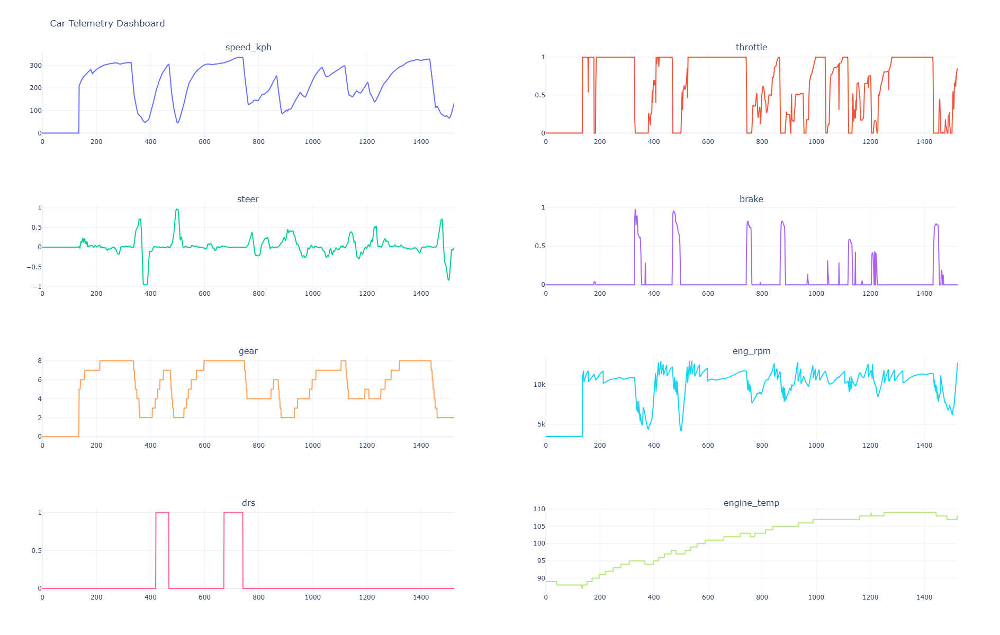

# f1_telem
Receive F1 2020 UDP telemetry and plot to interactive dashboard

## Project
~~Started out in python but noticed the telemetry was significantly delayed so decided to try and see if rust is any faster at dealing with the data.~~

After further review, it would appear that the appearance of a delay in the python data was due to a PEBKAC error and looking at the wrong portion of the packet. But, since I have gotten so much working with Rust, might as well stick with it. <sup><sub>Grumble grumble sunk cost fallacy grumble grumble<sub><sup>

## Running 
To run the code make sure you have `cargo` installed. If you don't you can follow the [cargo installation instructions](https://doc.rust-lang.org/cargo/getting-started/installation.html) to get started. Once cargo is installed running `cargo run` should start the UDP listening. If you would like to send the packets to a file for later plotting with python you can run `cargo run | tee misc/name_of_file.txt`

To run the python plotting script, first install dependencies via `pip install -r requirements.txt` and then run the script `python plottlm.py`

## Example Data
In the `misc/` folder some sample car packets are provided (the data should span about a lap). Packets have the following format:
```
CarTelemetryPacket { speed_kph: 96, throttle: 0.6951197, steer: -0.06636149, brake: 0.0, clutch: 0, gear: 2, eng_rpm: 9504, drs: 0, rev_light_percent: 0, brake_1_temp: 850, brake_2_temp: 849, brake_3_temp: 813, brake_4_temp: 813, tyre_1_surface_temp: 86, tyre_2_surface_temp: 84, tyre_3_surface_temp: 91, tyre_4_surface_temp: 89, tyre_1_inner_temp: 92, tyre_2_inner_temp: 91, tyre_3_inner_temp: 94, tyre_4_inner_temp: 91, engine_temp: 107, tyre_1_pressure: 21.474432, tyre_2_pressure: 21.422335, tyre_3_pressure: 23.140612, tyre_4_pressure: 22.967175, tyre_1_surf_type: 0, tyre_2_surf_type: 0, tyre_3_surf_type: 0, tyre_4_surf_type: 0 }

CarTelemetryPacket { speed_kph: 101, throttle: 0.61265266, steer: -0.072556674, brake: 0.0, clutch: 0, gear: 2, eng_rpm: 10020, drs: 0, rev_light_percent: 0, brake_1_temp: 847, brake_2_temp: 846, brake_3_temp: 809, brake_4_temp: 809, tyre_1_surface_temp: 86, tyre_2_surface_temp: 84, tyre_3_surface_temp: 90, tyre_4_surface_temp: 89, tyre_1_inner_temp: 92, tyre_2_inner_temp: 91, tyre_3_inner_temp: 94, tyre_4_inner_temp: 91, engine_temp: 107, tyre_1_pressure: 21.473377, tyre_2_pressure: 21.421059, tyre_3_pressure: 23.140104, tyre_4_pressure: 22.966883, tyre_1_surf_type: 0, tyre_2_surf_type: 0, tyre_3_surf_type: 0, tyre_4_surf_type: 0 }
```

A script has been provided (`plottlm.py`) to turn that data into an interactive HTLM dashboard with selected data parameters. The dashboard should look similar to the following screenshot: 

### Resources
[F1 2020 UDP Packet Specification](https://f1-2020-telemetry.readthedocs.io/en/stable/telemetry-specification.html#packet-information)

[Cargo](https://doc.rust-lang.org/cargo/getting-started/installation.html)