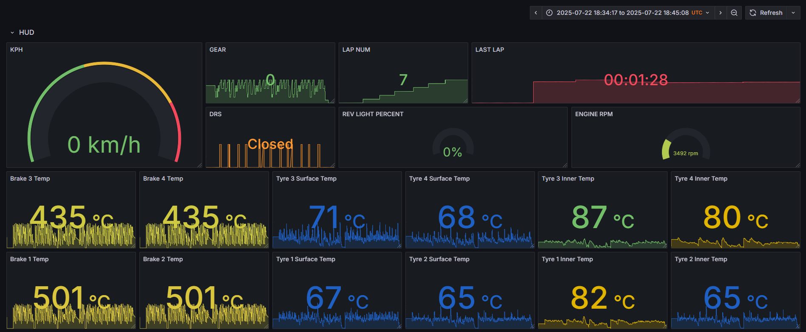

# f1_telem
Receive F1 2020 UDP telemetry and plot to interactive dashboard

## Resources
[F1 2020 UDP Packet Specification](https://f1-2020-telemetry.readthedocs.io/en/stable/telemetry-specification.html#packet-information)

[Cargo](https://doc.rust-lang.org/cargo/getting-started/installation.html)

[Grafana](https://grafana.com/docs/grafana/latest/setup-grafana/installation/debian/)

[Postgres Setup](https://documentation.ubuntu.com/server/how-to/databases/install-postgresql/)

[Installing Postgres 15+](https://askubuntu.com/questions/1456014/how-to-upgrade-postgresql-from-14-to-15-on-ubuntu-22-04)

[TimeScaleDB](https://docs.tigerdata.com/self-hosted/latest/install/installation-source/)

## Project
~~Started out in python but noticed the telemetry was significantly delayed so decided to try and see if rust is any faster at dealing with the data.~~

After further review, it would appear that the appearance of a delay in the python data was due to a PEBKAC error and looking at the wrong portion of the packet. But, since I have gotten so much working with Rust, might as well stick with it. Grumble grumble sunk cost fallacy grumble grumble

This project now puts its data into a Postgres TimeScaleDB which allows for the addition of Grafana for creating custom dashboards.

## Running 

### Prerequisites
- PostgreSQL 15 or greater with the TimeScaleDB extension.

- Grafana. I self hosted on my local machine but Grafana does support Docker and cloud based implementations as well. See the resources below for more.

- Cargo, the Rust package and dependency manager.

To run the code make sure you have `cargo` installed. If you don't you can follow the [cargo installation instructions](https://doc.rust-lang.org/cargo/getting-started/installation.html) to get started. Once cargo is installed running `cargo run` should start the UDP listening. 

### Python
Python is currently only partially supported in the form of a barebones Django REST Framework (DRF) API to read from the F1 database. It is not fully operational.
